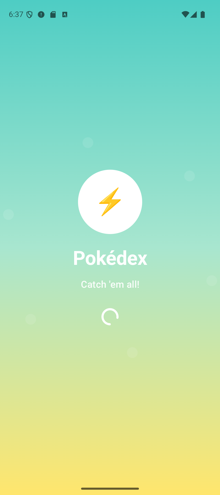
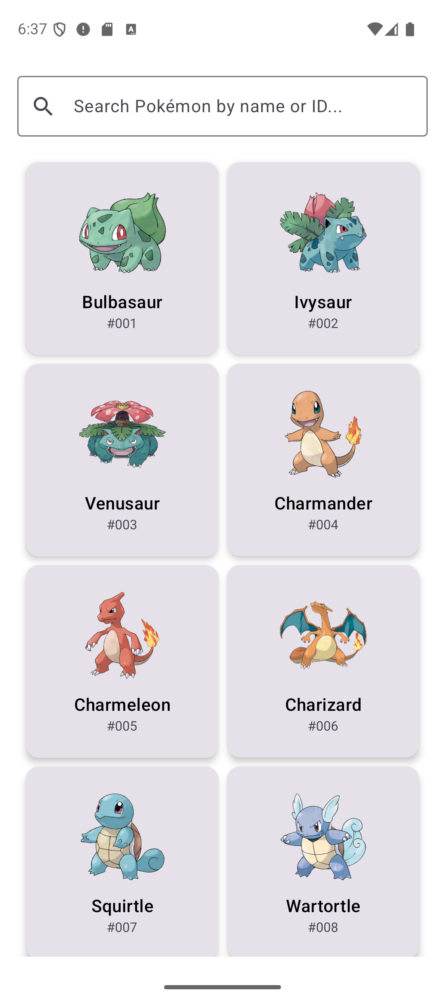
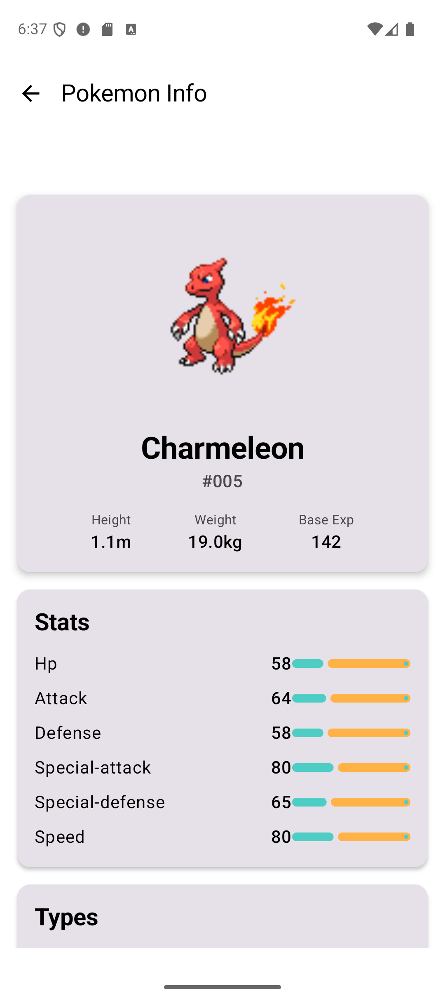
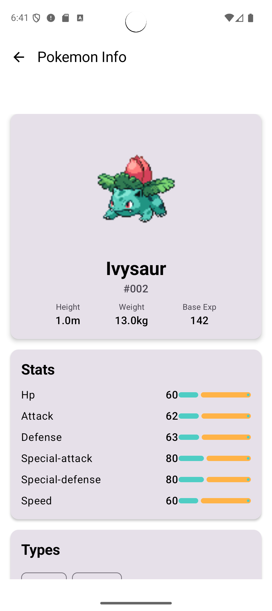

# Pokédex Android App 🎮

A modern, senior-level Android application built with **MVVM architecture**, **Clean Code principles**, and **multi-module structure**. This app provides a comprehensive Pokédex experience using the [PokeAPI](https://pokeapi.co/).

## 🏗️ Architecture & Design Patterns

### **MVVM (Model-View-ViewModel)**
- **ViewModels**: Handle UI state and business logic
- **LiveData/StateFlow**: Reactive data streams for UI updates
- **Repository Pattern**: Clean data access layer
- **Use Cases**: Business logic encapsulation

### **Clean Architecture**
- **Presentation Layer**: UI components and ViewModels
- **Domain Layer**: Use cases and business logic
- **Data Layer**: Repositories and data sources
- **Dependency Inversion**: Interfaces and abstractions

### **SOLID Principles**
- **Single Responsibility**: Each class has one reason to change
- **Open/Closed**: Open for extension, closed for modification
- **Liskov Substitution**: Subtypes are substitutable
- **Interface Segregation**: Client-specific interfaces
- **Dependency Inversion**: Depend on abstractions, not concretions

## 🏛️ Project Structure

```
app/
├── src/main/java/com/velaphi/pokemons/
│   ├── MainActivity.kt          # Main activity with navigation
│   ├── PokemonApplication.kt    # Hilt application class
│   └── ui/theme/               # App theme and colors
│
core/                              # Core utilities and interfaces
├── src/main/java/com/velaphi/pokemons/core/
│   ├── Result.kt                # Result wrapper for API responses
│   ├── BaseRepository.kt        # Base repository interface
│   └── BaseUseCase.kt           # Base use case interfaces
│
network/                           # Networking layer
├── src/main/java/com/velaphi/pokemons/network/
│   ├── api/                     # API service interfaces
│   ├── model/                   # Data models
│   ├── repository/              # Repository implementations
│   ├── usecase/                 # Use case implementations
│   └── di/                      # Dependency injection modules
│
homemodule/                        # Home screen feature module
├── src/main/java/com/velaphi/pokemons/homemodule/
│   ├── HomeViewModel.kt         # Home screen ViewModel
│   └── HomeScreen.kt            # Home screen UI components
│
infomodule/                        # Pokemon info feature module
├── src/main/java/com/velaphi/pokemons/infomodule/
│   ├── InfoViewModel.kt         # Info screen ViewModel
│   └── InfoScreen.kt            # Info screen UI components
```

## 🚀 Features

### **Home Screen**
- ✅ Display first 100 Pokemon from PokeAPI
- ✅ Beautiful grid layout with Pokemon cards
- ✅ Search functionality (by name or ID)
- ✅ Pokemon images from official artwork
- ✅ Loading states and error handling
- ✅ Pull-to-refresh functionality

### **Info Screen**
- ✅ Detailed Pokemon information
- ✅ High-quality Pokemon images
- ✅ Comprehensive stats display
- ✅ Type information with visual chips
- ✅ Abilities (including hidden abilities)
- ✅ Forms and variations
- ✅ Responsive design with Material3

### **Technical Features**
- ✅ **MVVM Architecture** with ViewModels
- ✅ **Jetpack Compose** for modern UI
- ✅ **Hilt** for dependency injection
- ✅ **Retrofit** for API communication
- ✅ **Coil** for image loading
- ✅ **Navigation Compose** for screen navigation
- ✅ **Splash Screen** with Material3 design
- ✅ **Material3 Design System** with custom Pokemon theme
- ✅ **Coroutines & Flow** for asynchronous operations
- ✅ **Error handling** with user-friendly messages
- ✅ **Offline-first** architecture ready

## 🛠️ Technology Stack

### **Core Technologies**
- **Kotlin** - Modern programming language
- **Android SDK** - Platform APIs
- **Jetpack Compose** - Declarative UI toolkit
- **Material3** - Design system

### **Architecture Components**
- **ViewModel** - UI state management
- **LiveData/StateFlow** - Reactive programming
- **Repository Pattern** - Data access abstraction
- **Use Cases** - Business logic encapsulation

### **Dependency Injection**
- **Hilt** - Android dependency injection library
- **Multi-module** - Feature-based module structure

### **Networking**
- **Retrofit** - HTTP client for API calls
- **OkHttp** - HTTP client with interceptors
- **Moshi** - JSON parsing library

### **Image Loading**
- **Coil** - Modern image loading library
- **Async image handling** - Efficient memory management

### **Navigation**
- **Navigation Compose** - Type-safe navigation
- **Deep linking** support ready

## 📱 Screenshots

### **App Screenshots**

#### **Splash Screen**


#### **Home Screen - Pokemon List**


#### **Home Screen - Search Results**


#### **Info Screen - Pokemon Details**


### **App Features Showcase**

The screenshots above demonstrate:
- **Modern Material3 Design**: Clean, intuitive interface following Google's latest design guidelines
- **Responsive Layout**: Optimized for various screen sizes and orientations
- **Beautiful Pokemon Cards**: High-quality images with smooth animations
- **Comprehensive Information**: Detailed stats, types, and abilities display
- **Search Functionality**: Easy Pokemon discovery by name or ID
- **Professional UI**: Polished user experience with proper loading states and error handling

## 🚀 Getting Started

### **Prerequisites**
- Android Studio Hedgehog or later
- Android SDK 36 (API level 36)
- Minimum SDK: 24 (Android 7.0)
- Java 17 or later

### **Installation**

1. **Clone the repository**
   ```bash
   git clone https://github.com/yourusername/pokemon-android.git
   cd pokemon-android
   ```

2. **Open in Android Studio**
   - Open Android Studio
   - Select "Open an existing project"
   - Navigate to the cloned directory

3. **Sync and Build**
   - Wait for Gradle sync to complete
   - Build the project (Build → Make Project)

4. **Run on Device/Emulator**
   - Connect a device or start an emulator
   - Click the Run button (▶️)

### **Build Variants**
- **Debug**: Development build with logging
- **Release**: Production build (optimized)

## 🔧 Configuration

### **API Configuration**
The app uses the [PokeAPI](https://pokeapi.co/) which is free and doesn't require authentication.

### **Customization**
- **Colors**: Modify `app/src/main/res/values/colors.xml`
- **Theme**: Update `app/src/main/java/com/velaphi/pokemons/ui/theme/`
- **API Base URL**: Change in `network/src/main/java/com/velaphi/pokemons/network/di/NetworkModule.kt`

## 🧪 Testing

### **Unit Tests**
- ViewModels
- Use Cases
- Repositories
- Utilities

### **UI Tests**
- Screen navigation
- User interactions
- Error scenarios

### **Integration Tests**
- API communication
- Data flow
- Module interactions

## 📊 Performance

### **Optimizations**
- **Lazy loading** for Pokemon images
- **Efficient memory management** with Coil
- **Background processing** with Coroutines
- **Minimal network calls** with smart caching

### **Memory Management**
- **Image caching** strategies
- **Efficient data structures**
- **Background task management**

## 🔒 Security

### **Network Security**
- **HTTPS only** API communication
- **Certificate pinning** ready
- **Secure data transmission**

### **Data Protection**
- **No sensitive data storage**
- **Secure preferences** with DataStore
- **Biometric authentication** ready

## 🌐 API Integration

### **PokeAPI Endpoints Used**
- `GET /api/v2/pokemon` - Pokemon list
- `GET /api/v2/pokemon/{id}` - Pokemon details

### **Data Models**
- **PokemonListItem**: Basic Pokemon information
- **PokemonDetailResponse**: Comprehensive Pokemon data
- **Sprites**: Pokemon images and artwork
- **Stats**: Pokemon statistics and abilities

## 🎨 UI/UX Design

### **Design Principles**
- **Material3 Design System**
- **Accessibility first** approach
- **Responsive design** for all screen sizes
- **Intuitive navigation** patterns

### **Color Scheme**
- **Pokemon-themed colors** (blue, yellow, green, red)
- **High contrast** for readability
- **Consistent theming** across screens

### **Typography**
- **Material3 typography** scale
- **Readable fonts** for all content
- **Hierarchical information** display

## 📈 Future Enhancements

### **Planned Features**
- [ ] **Offline support** with Room database
- [ ] **Favorites system** for Pokemon
- [ ] **Advanced search** with filters
- [ ] **Pokemon comparisons** feature
- [ ] **Evolution chains** display
- [ ] **Move details** and descriptions
- [ ] **Dark/Light theme** toggle
- [ ] **Localization** support

### **Technical Improvements**
- [ ] **Paging3** for large lists
- [ ] **WorkManager** for background tasks
- [ ] **DataStore** for preferences
- [ ] **Biometric authentication**
- [ ] **Deep linking** implementation
- [ ] **Widget support**

## 🤝 Contributing

### **Development Guidelines**
1. **Follow MVVM architecture** patterns
2. **Use Clean Code principles**
3. **Write comprehensive tests**
4. **Follow Material3 design guidelines**
5. **Document all public APIs**

### **Code Style**
- **Kotlin coding conventions**
- **Compose best practices**
- **Material3 design patterns**
- **Accessibility guidelines**

## 📄 License

This project is licensed under the MIT License - see the [LICENSE](LICENSE) file for details.

## 🙏 Acknowledgments

- **PokeAPI** for providing comprehensive Pokemon data
- **Google** for Android platform and Jetpack libraries
- **Material Design** team for design system
- **Open source community** for libraries and tools

